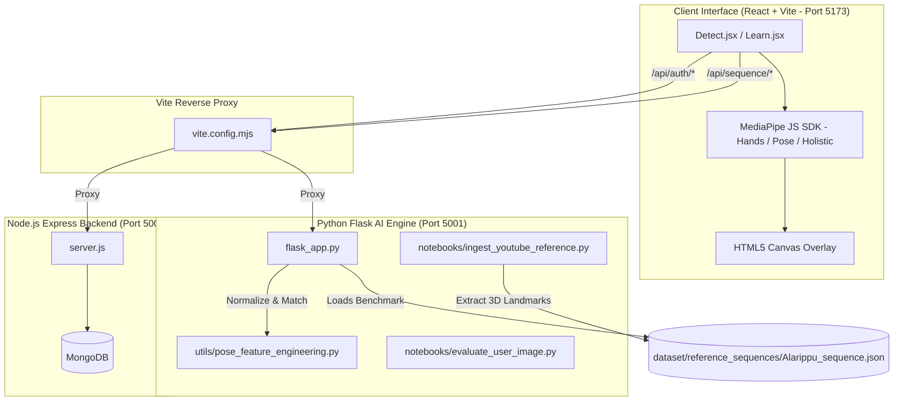

# 🏛️ GestureIQ — Complete Technical Architecture & Full-Body Posture Engine Report

> **Document Purpose:** This document provides a complete, self-contained, end-to-end technical overview of the **GestureIQ** platform. It details the system architecture, mathematical formulas, 3D pose normalization, YouTube video reference ingestion pipeline, real-time posture matching, active codebase structure, and current technical loopholes for AI evaluation and future development.

---

## 1. Executive Overview & System Architecture

GestureIQ is an AI-powered classical Indian dance (Bharatanatyam) posture and gesture analytics platform. It evaluates:
1. **Asamyuta Hasta (Single-Hand Mudras):** 28 classical single-hand gestures (Pataka, Tripataka, Ardhapataka, etc.).
2. **Samyuta Hasta (Double-Hand Mudras):** 23 classical double-hand gestures (Anjali, Kapotha, Karkata, etc.).
3. **Adavu Posture Analytics:** Real-time 3D stance evaluation (Araimandi, Muzhumandi, Samapada).
4. **Full-Body Dance Sequence Benchmark Engine:** Compares a live student or uploaded image/video against an expert dancer's YouTube reference video (e.g., *Alarippu*, *Pushpanjali*).



---

## 2. YouTube Full-Body Reference Ingestion & Benchmark Pipeline

### How We Process YouTube Videos for Full-Body Stance Benchmarking:

```
[YouTube Video Link] 
        ↓  (yt-dlp download MP4)
[dataset/raw_reference_videos/Alarippu.mp4]
        ↓  (Extract at 5 FPS using MediaPipe Pose)
[3D World Coordinates (x, y, z)]
        ↓  (Scale & Hip Normalization)
[Normalized 3D Landmarks]
        ↓  (Calculate 3D Joint Angles)
[dataset/reference_sequences/Alarippu_sequence.json]
```

### Step 1: Downloading & Frame Extraction ([ingest_youtube_reference.py](file:///d:/GestureIQ/notebooks/ingest_youtube_reference.py))
- Reads YouTube URL or local MP4 path via standard CLI command:
  ```cmd
  python notebooks/ingest_youtube_reference.py --url "https://youtu.be/..." --name Alarippu
  ```
- Downloads video to `dataset/raw_reference_videos/<name>.mp4` via `yt-dlp`.
- Processes video frame-by-frame at **5 FPS** using MediaPipe Pose (`model_complexity=2`, `min_detection_confidence=0.5`).

---

## 3. Mathematical Foundations: 3D Scale Normalization & Feature Engineering

### Why Raw MediaPipe Landmarks Fail Without Normalization:
Raw $(x, y, z)$ pixel coordinates depend on distance from camera, video resolution, zoom level, and camera height. A dancer standing 2 meters away will have smaller coordinate values than a dancer standing 1 meter away.

### Our Solution: 3D Scale & Centering Normalization ([utils/pose_feature_engineering.py](file:///d:/GestureIQ/utils/pose_feature_engineering.py))

#### 1. Center of Gravity (Hip Origin):
The origin $(0, 0, 0)$ is set to the midpoint between the left hip (landmark 23) and right hip (landmark 24):
$$\text{Hip Center} = \frac{\mathbf{P}_{23} + \mathbf{P}_{24}}{2}$$

#### 2. Torso Length Scale Factor:
To make the model size-invariant (so a child, adult, tall, or short dancer produce identical features), coordinates are scaled by the 3D distance between Hip Center and Shoulder Center ($\text{midpoint of } \mathbf{P}_{11}, \mathbf{P}_{12}$):
$$\text{Shoulder Center} = \frac{\mathbf{P}_{11} + \mathbf{P}_{12}}{2}$$
$$\text{Torso Length } L = \|\text{Shoulder Center} - \text{Hip Center}\|_2$$

#### 3. Normalized Coordinate Vector:
$$\mathbf{P}_{\text{norm}, i} = \frac{\mathbf{P}_i - \text{Hip Center}}{L} \quad \text{for } i \in [0, 32]$$

---

### 3D Joint Angle Formulas

We compute key anatomical angles using 3D vector dot products:

$$\theta = \arccos\left( \frac{\vec{u} \cdot \vec{v}}{\|\vec{u}\| \|\vec{v}\|} \right) \times \frac{180}{\pi}$$

1. **Knee Bend Angle (Araimandi Depth):**
   - **Left Knee:** $\vec{u} = \mathbf{P}_{23} - \mathbf{P}_{25}$, $\vec{v} = \mathbf{P}_{27} - \mathbf{P}_{25}$
   - **Right Knee:** $\vec{u} = \mathbf{P}_{24} - \mathbf{P}_{26}$, $\vec{v} = \mathbf{P}_{28} - \mathbf{P}_{26}$
   - *Target for Araimandi:* $\sim 115^\circ - 130^\circ$.
2. **Elbow Extension Angle (Arm Levelness):**
   - **Left Elbow:** $\vec{u} = \mathbf{P}_{11} - \mathbf{P}_{13}$, $\vec{v} = \mathbf{P}_{15} - \mathbf{P}_{13}$
   - **Right Elbow:** $\vec{u} = \mathbf{P}_{12} - \mathbf{P}_{14}$, $\vec{v} = \mathbf{P}_{16} - \mathbf{P}_{14}$
3. **Torso Vertical Tilt:**
   - Vector from Hip Center to Shoulder Center vs vertical axis $(0, 1, 0)$:
   $$\text{Torso Tilt} = \arctan\left(\frac{|x_{\text{spine}}|}{y_{\text{spine}}}\right) \times \frac{180}{\pi}$$

---

## 4. Full-Body Landmark Visibility Guard (`check_full_body_visibility`)

### Problem Identified:
When a user sits at a laptop desk, MediaPipe Pose still returns 33 keypoints, but "hallucinates" missing hips/knees onto their face/chin/desk. This caused false knee angle calculations (`132°` on face) and false warnings (*"Sit lower in Araimandi!"*).

### Solution Implemented ([utils/pose_feature_engineering.py](file:///d:/GestureIQ/utils/pose_feature_engineering.py#L9-L32)):
We evaluate landmark confidence/visibility for key joints:
- Shoulders: 11, 12
- Hips: 23, 24
- Knees: 25, 26

$$\text{If } \text{visibility}(\text{hip}) < 0.45 \text{ or } \text{visibility}(\text{knee}) < 0.45 \implies \text{Full Body Not Visible}$$

When triggered:
- **Webcam HUD & Web UI:** Displays `"⚠️ STEP BACK: Hips/Knees out of frame"`
- Suppresses false angle readouts and invalid posture penalty calculations.

---

## 5. Live Posture Matching & Scoring Engine

When evaluating a live student frame (or uploaded image):

$$\text{Error}_{\text{total}} = 0.30(\Delta \text{Knee}_L + \Delta \text{Knee}_R) + 0.15(\Delta \text{Elbow}_L + \Delta \text{Elbow}_R) + 0.10(\Delta \text{Torso Tilt})$$

$$\text{Posture Score} = \max\left(0, 100 - \text{Error}_{\text{total}}\right)$$

### Grading Thresholds:
- **$90\% - 100\% \implies \mathbf{A+}$** (Excellent posture alignment)
- **$80\% - 89\% \implies \mathbf{A}$** (Good posture)
- **$70\% - 79\% \implies \mathbf{B}$** (Fair alignment)
- **$< 70\% \implies \mathbf{\text{Needs Practice}}$** (Triggers specific correction alerts)

---

## 6. Key Codebase Files Map

| Path | Purpose |
| :--- | :--- |
| [utils/pose_feature_engineering.py](file:///d:/GestureIQ/utils/pose_feature_engineering.py) | Central 3D pose scale normalization, angle computation, & visibility checks |
| [notebooks/ingest_youtube_reference.py](file:///d:/GestureIQ/notebooks/ingest_youtube_reference.py) | Downloads & ingests YouTube dance videos into sequence JSON benchmarks |
| [notebooks/evaluate_user_image.py](file:///d:/GestureIQ/notebooks/evaluate_user_image.py) | Single-image full-body posture evaluation script |
| [notebooks/test_realtime_posture.py](file:///d:/GestureIQ/notebooks/test_realtime_posture.py) | Standalone real-time OpenCV webcam posture tester |
| [notebooks/flask_app.py](file:///d:/GestureIQ/notebooks/flask_app.py) | Flask AI backend endpoints (`/api/sequence/evaluate_image`, mudra classifiers) |
| [gestureiq-web/src/pages/Detect.jsx](file:///d:/GestureIQ/gestureiq-web/src/pages/Detect.jsx) | React luxury UI with MediaPipe JS integration, canvas overlay, and tabs |
| [gestureiq-web/vite.config.mjs](file:///d:/GestureIQ/gestureiq-web/vite.config.mjs) | Vite dev server proxy configuration routing `/api/*` to ports 5000 & 5001 |
| [start_all.bat](file:///d:/GestureIQ/start_all.bat) | One-click launcher starting Node backend, Flask AI server, Vite UI, & ngrok |

---

## 7. Current System Technical Loopholes & Recommended Enhancements

### ⚠️ Known Loopholes & Challenges to Address Next:

1. **Temporal Sequence Alignment (DTW - Dynamic Time Warping):**
   - *Current Behavior:* Image/webcam evaluation compares live frames against reference frames individually or by static frame index.
   - *Limitation:* If a student performs the dance faster or slower than the reference YouTube video, frame index matching drifts out of sync.
   - *Recommended Solution:* Implement Dynamic Time Warping (DTW) across normalized joint angle trajectories $(t_1, t_2, \dots, t_N)$ to compare dance tempo independently.

2. **Camera Perspective Angle / 2D-to-3D Projection Distortion:**
   - *Current Behavior:* MediaPipe Pose estimates 3D world coordinates $(x,y,z)$ relative to hip center.
   - *Limitation:* If camera is tilted upward (e.g. laptop on low coffee table), vertical $y$-axis tilt distorts torso tilt calculations by $5^\circ - 10^\circ$.
   - *Recommended Solution:* Apply rotation matrix normalization using shoulder line vector and gravity vector to align student camera plane to absolute vertical.

3. **Hand Mudra + Full-Body Pose Joint Occlusion:**
   - *Current Behavior:* Hand mudras (e.g. Katakamukha) are high-detail finger gestures, while body pose tracks large limbs.
   - *Limitation:* In fast dance movements, hands pass in front of torso, causing temporary finger landmark jitter.
   - *Recommended Solution:* Use MediaPipe Holistic or Dual-Crop pipeline (crop bounding box around hands when pose indicates arms are active).

4. **Reference Dance Item Multi-Choreography Expansion:**
   - *Current Dataset:* *Alarippu* benchmark contains 1,191 frames at 5 FPS.
   - *Next Steps:* Ingest additional items (*Pushpanjali*, *Jatiswaram*, *Shabdam*) into `dataset/reference_sequences/`.

---

## 💡 Summary for AI Engine / Gemini Prompting

If sharing this project context with another AI to refine or extend the pipeline:
> "GestureIQ is a Bharatanatyam dance analytics platform using Python Flask + React Vite + MediaPipe. We convert YouTube expert dance videos into normalized 3D benchmark JSON sequences via `ingest_youtube_reference.py`. Landmarks are origin-centered at Hip Center and scaled by 3D Torso Length. 3D joint angles (knees, elbows, torso tilt) are compared against reference benchmarks using dot products. Full-body landmark visibility thresholding ($\text{visibility} \ge 0.45$) guards against hallucinated keypoints when lower body is off-camera."
